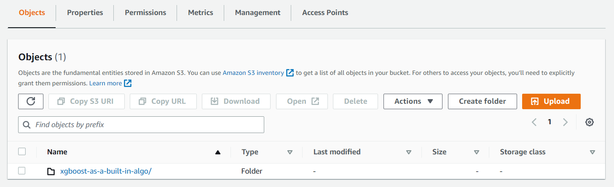

## AWS SageMaker

Amazon SageMaker is a fully managed machine learning service. With SageMaker, data scientists and developers can quickly and easily build and train machine learning models, and then directly deploy them into a production-ready hosted environment. It provides an integrated Jupyter authoring notebook instance for easy access to your data sources for exploration and analysis, so you don't have to manage servers. It also provides common machine learning algorithms that are optimized to run efficiently against extremely large data in a distributed environment. With native support for bring-your-own-algorithms and frameworks, SageMaker offers flexible distributed training options that adjust to your specific workflows. Deploy a model into a secure and scalable environment by launching it with a few clicks from SageMaker Studio or the SageMaker console ([read more here](https://aws.amazon.com/sagemaker/) or [here](https://docs.aws.amazon.com/sagemaker/latest/dg/whatis.html)).

## Lets get started with notebook instance

You are probably familiar with jupyter noteeboks. If not Jupyter Notebook is an open-source web application that allows you to create and share documents containing live code, equations, visualizations, and narrative text. It supports many programming languages, including Python, R, Julia, and others, and allows you to combine code, text, and multimedia elements in a single document. 

Pick Amazon SageMaker from services on aws. You can ither use Amazon SageMaker Studio or Notebook instance to build your code. First, select the option "Notebook instance" from the menu, within which we will create a new jupiter notebook. 

1. Click on "Create notebook instance"
2. Give a notebook a name (e.g StartingWithML)
3. Select instance type "ml.t2.medium"
4. Leave other options as defualt and select "create notebook instance"

It will take some time to launch notebook instances. Once it showed status as "InService" you can click on "Open jupyter" option which will launched a new jupyter notebook instance. Create new python script by clicking on new->conda_python3. You can also use upload button to upload existing files from your computer. Play a bit with your fresh notebook before next step. 

Try also to start up with Amazon SageMaker Studio and create some sample code. Dont forget to add screenshots from your path into readme!


## Build, train and deploy machine learning model

Before we start you have to create new S3 bucket instance to have storage for our machine leaning model. I bet you can do this by your own. Then download the file code.ipynb from this repo and upload it into jupyter. Examine the code a bit. Now you can delete the S3 backet that you created. WHY? Because we can do it with python code so it will be automatic.


Insert this code in the first part of jupyter notebook. Dont forget to change your bucket_name.

```
# Python code:

bucket_name = 'yournamefors3' # <--- CHANGE THIS VARIABLE TO A UNIQUE NAME FOR YOUR BUCKET
my_region = boto3.session.Session().region_name # set the region of the instance
print(my_region)

s3 = boto3.resource('s3')
try:
    if  my_region == 'us-east-1':
        s3.create_bucket(Bucket=bucket_name)
    print('S3 bucket created successfully')
except Exception as e:
    print('S3 error: ',e)
```

Execute the code and check if your bucket was created sucessfully. 

To train ML model we need some data. In our example we will use public accesable dataset that is basically saing us if the customer is going to buy a service or not based on many feature variables. Examine the next part of the code "Downloading The Dataset And Storing in S3" and execute it. To read csv data we will use pandas which is an open-source data manipulation and analysis library for the Python programming language. It provides high-performance, easy-to-use data structures and data analysis tools for handling structured data. Check [this](https://pandas.pydata.org/pandas-docs/stable/user_guide/10min.html) quick guide for pandas if you did not work with it before. Follow the code and make train/test split on data to devide datase into training a testing subsets. Remember that our dependent features are y_yes and y_no (meaning if costumer buy service or dont). After you upladed train data into bucket go and check if everything works well. You should see new folder in you S3 bucket.



Inside this folder you can find your training subset. You can download it anytime you want and also store multiple version of it. Do the same steps also for test data and check if everything was upladed sucessfully. 

In the next step we are going to use Xgboot model which is a inbuild ML model. "Retrieve" function is used retrieve docker image matching the given arguments. In our case we are downloading the xgboost model from boto3 libraby with all configurations. For more info check . After this there is a hyperparameter tuning. You can read more about each hyperparameter . Once the hyperparameters are inicialized we can construct a SageMaker estimator that calls the xgboost-container. Dont hesitate to read more about parameters of Estimator class. Basically we are just defining our estimator. To reduce billing keep the parameters "use_spot_instances", "max_run" and "max_wait" as they are.


TODO task: Try to play a bit with hyperparameter and document different results. 

TODO task: change the code and use your custom ML algorithm